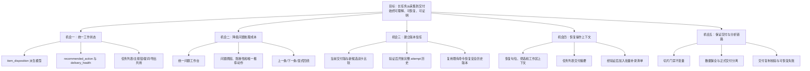

# DataBaker 产品升级迭代方案

> 日期：2026-08-26
> 代码基线：`main@5e7d523`
> 方案状态：待现场验证后进入小步构建
> 产品主题：从“安全逐句录音工具”升级为“任务闭环与质检工作台”

## 1. 决策摘要

0826 反馈涉及的三列导入、标签展示与提醒、列表跟随、重录后进入物理下一句、标签字号和首录节奏已经形成可用基线。本轮不再重复这些功能，也不先做大范围视觉翻新。

下一阶段应优先解决一个更底层的产品问题：同一份录音数据在任务列表、主按钮、问题入口和导出区域可能被解释为不同的工作状态。操作员现在能够安全录制和保留历史版本，但仍需要自己判断：

- 当前唯一正确的下一步是什么；
- 哪些问题阻断正式交付，哪些只是警告；
- 当前实际采用哪个 attempt；
- 重启或转入补录后应该从哪里继续；
- “数据已保全”和“切片已可交付”是不是同一件事。

本方案的 Build Risk Review 结论是 **BUILD SMALL**：先建立统一的状态规范、修复已经确认的导出与交付假绿灯、补齐当前版/候选版比较，并建设一条真实 Electron 黄金流程；现场验证成立后，再扩展完整版本历史、问题工作台和操作上下文恢复。

排期拆成两部分：已确认的可靠性与版本入口为 **9–13 人日**；现场验证及验证通过后的产品升级为 **18–27 人日**。全部条件项都进入时合计 **27–40 人日**，不是一次性承诺。迭代零完成后必须依据技术 spike 和现场结果重新估算。

## 2. 方法与证据边界

本方案按以下产品 Skill 链路形成：

`反馈归纳 → 作业旅程 → 问题定义 → 机会树 → 构建风险评审 → 多框架排序 → 方案简报 → 边界场景 → 验收条件`

### 2.1 证据

| 证据 | 能支持的结论 | 局限 | 证据强度 |
|---|---|---|---|
| `采集人员反馈-0826.docx` | 标签、长脚本定位、非连续重录和字号确实影响现场操作 | 是一份汇总文件，参与者数量和出现频率未知 | medium |
| 用户提供的 50 条与 110 条实际脚本 | 三列结构、长标签和真实标签分布不是虚构场景 | 不能代表全部项目类型 | medium |
| `af6a64e` 至 `5e7d523` 的连续修正 | 首录节奏、重录版本、标签边界和列表语义容易产生回归 | 证明实现风险，不等同于证明全部新功能需求 | strong |
| 当前 React/Rust 状态和导出逻辑 | 可以准确识别现有语义冲突、缺失入口和安全不变量 | 代码不能说明操作员的心理模型和使用频率 | strong |
| 当前自动测试与 Windows CI | 单元、构建、打包和部分协议行为已有基础门禁 | 源码正则测试和托管 CI 不能代替真实界面与声卡流程 | medium |

### 2.2 研究限制

这不是三名以上独立用户访谈的饱和研究。下文对“常见痛点”“情绪”和“功能使用频率”的判断均为**单一来源的暂定信号**或**低置信假设**，不能表述为行业共识。

在扩大工作台重构前，需要用至少 3 名实际操作员完成验证；可靠性修复、状态不变量和测试底座不依赖这项需求验证，可并行推进。

## 3. 0826 反馈归纳与当前基线

| 原始反馈信号 | 操作需求 | 当前基线 | 本轮处理 |
|---|---|---|---|
| 左栏每句显示标签 | 长任务中无需离开句子列表即可确认朗读要求 | 已完成；普通标签中性展示，边界才用紫色 | 作为回归基线 |
| 标签变化需要醒目提醒 | 防止沿用上一段话术或语气 | 已完成；主控与提词端同步，暂停可配置 | 作为回归基线 |
| 当前句需要自动跟随 | 320–1000 句任务中保持空间定位 | 已完成；`currentIndex` 变化时就近滚动 | 作为回归基线 |
| 重录 30 后应进入 31 | 补录是局部连续作业，不能跳回首轮未完成点 | 已完成；版本决策后进入物理下一句且不自动开录 | 作为回归基线 |
| 标签字号可调整 | 不同场地和距离下保持可读 | 已完成；12–40px、2px 步长、双端同步 | 作为回归基线 |

由这些反馈只能暂定推断出一个更高层机会：操作员需要在长任务中持续维持**位置、任务状态和交付状态的情境感知**。这一推断需要现场验证，不能把五条 UI 反馈直接等同为“必须重构全部工作台”。

## 4. 当前作业旅程

主要角色是固定工位的采集操作员；朗读员通过独立提词窗接收正文、标签和开口提示；下游质检/数据人员目前只接收导出物，没有独立应用内角色。

| 阶段 | 操作员目标 | 已有能力 | 当前摩擦或风险 | 证据状态 |
|---|---|---|---|---|
| 任务导入 | 确认脚本结构和标签后安全建任务 | 三列校验、TXT 兼容、前 10 行和统计预览 | 大文件出错时只看到有限错误，仍需回外部编辑器定位 | 代码证据；需求频率未知 |
| 任务准备 | 明确设备、规则和本次录制节奏 | 环境检查、静音规则、本机路径相关的工作站规则 | 关键规则只存在 `localStorage` 且部分进入工作台后才可见，不是随任务携带的录制契约 | 代码证据 |
| 首轮采集 | 保持稳定的结束、确认、自动续录节奏 | 连续母轨、自动保存、标签提醒、双端提词 | 任何状态提示回归都会直接打断肌肉记忆 | 反馈与连续修正证据 |
| 问题发现 | 知道哪些句子需要处理以及原因 | 需重录计数和下一条入口、静音/异常诊断 | 问题分散在侧栏、主区和导出区，没有统一队列 | 代码证据；效率影响待测 |
| 重录与版本决策 | 对比旧交付版与新候选并明确采用版本 | 后端保留全部 attempt，旧版不被自动覆盖 | 主界面只能直接试听新候选，缺完整历史和双版本信息 | 代码证据；高可信缺口 |
| 暂停与恢复 | 重启后继续原任务且不幽灵开录 | 音频、journal、snapshot 和候选状态可恢复 | 最后位置、问题筛选和操作上下文不完整 | 代码证据；高可信缺口 |
| 关闭与交付 | 明确任务能否交付、能交付什么、复制是否成功 | 正式切片有底层门禁，整轨/诊断可保全 | “保全导出”和“正式交付”语义混合；首页与工作台摘要不一致 | 代码证据；高风险 |

情绪曲线仅为**低置信假设**：任务准备时谨慎，启用设备时焦虑，连续首录时追求不被打断，版本决策时不确定性最高，异常恢复时首先关心数据是否仍安全，交付时最需要清晰的肯定或阻断结论。

## 5. 问题定义

### 5.1 核心问题陈述

固定工位的采集操作员需要在 320–1000 句的任务中持续录制、局部补录、恢复并交付。虽然底层录音和 attempt 历史已经能够保护数据，但应用缺少一套跨页面一致的“下一步动作”和“交付就绪度”模型，导致操作员必须从多个状态、提示和版本关系中自行推断任务含义。

结果是：

- 同一条句子可能同时被表现为“已录制”“需重录”或“仍用旧版”；
- 一个任务可能显示“完成”，但仍有沿用旧版警告或待版本决策；
- 导出成功不一定代表正式交付已成功复制到目标位置；
- 恢复后音频是完整的，但操作员的工作上下文可能丢失；
- 在长任务中，处理顺序和版本选择仍依赖记忆。

### 5.2 目标结果

升级后，操作员在任一关键页面都应能快速、准确回答：

1. 当前句和当前任务的下一步动作是什么；
2. 当前会交付哪个版本；
3. 是否允许正式切片交付；
4. 如果不允许，最先需要处理哪一项；
5. 上次退出前处理到了哪里。

具体时间目标由迭代零建立基线后确定；小样本阶段只用逐人成功/失败计数，不作统计显著性表述。

### 5.3 非目标

本轮不纳入：

- 授权、许可证、签发、安装包签名和发布证据；
- Windows 真实声卡发布资格认定；
- 云账号、团队协作、服务端质检或独立 QA 角色；
- 波形剪辑、切点手工编辑和 DAW 类能力；
- 全局视觉换肤或为了“高级感”重画全部页面；
- 全局无障碍重构、设备前检大改；
- VAD 有界队列、任务历史搜索；两项沿用此前“暂缓”决定，只保留在独立 backlog；
- 强制迁移旧任务或重写已有母轨/attempt 存储核心。

本轮文档中的“质检”仅指采集操作员在本机进行的录音质量检查、版本判断和问题处理，不包含独立审核角色、驳回流转或多人协作。

### 5.4 明确暂缓的 backlog

以下事项不进入本轮工期和验收，重新启动前需用户确认范围：

- **VAD 队列**：代码审计确认当前分析通道无界，但此前已明确暂缓。重新启动时不能只把 `unbounded` 改为 `bounded`，必须先定义容量的音频毫秒预算、控制消息独立通道/保留容量、`Full` 与 `Disconnected` 区分、Reset/Flush 不丢失、active attempt 降级与正常结束、无 active attempt 隔离、分类器 panic、计数和故障注入测试。
- **任务历史搜索**：继续暂缓；本轮只改当前任务摘要，不增加跨任务索引或搜索。
- **一键诊断包**：需要单独定义脱敏内容、版本绑定和存储位置后再排期。
- **创建后设备启用失败的空任务生命周期**：需要新的任务状态或清理策略，不能顺手塞进 UI 清理。
- **可携带的操作上下文 sidecar**：本轮默认只做本机辅助状态；跨机器交接需要新的持久化契约。

## 6. 机会树



## 7. 统一产品状态模型

不改变现有磁盘中的 `pending/review/accepted/skipped` 主状态，也不重做 `src/recording-workflow.ts` 已有的标签边界、需重录、候选待确认和自动续录纯函数。本轮在这些函数上组合出统一的工作流呈现模型。

产品状态与物理交付校验必须分层：

1. **工作流呈现层（TypeScript）**：从 snapshot、item、attempt 和 selected 纯计算，负责告诉操作员当前含义和推荐动作。
2. **导出授权层（Rust）**：持有任务锁后独立检查母轨、物理帧数、样本边界、capture provenance、故障标记和目标范围，是是否允许导出的最终权威。

两层共享一份规范状态矩阵和 JSON fixtures，通过 parity tests 保证一致；前端门禁只负责提前解释，不能代替引擎授权。

### 7.1 采集状态与句子状态分离

既有 `capture_state` 继续表达未进入任务、前检、就绪、正在录音、停止中、只读和故障等实时采集状态。句子处理另用三组正交字段：

```text
item_disposition:
  unrecorded
  first_take_review
  retake_review
  rerecord_required
  selected
  retained_previous
  skipped

recommended_action:
  record
  confirm_first
  decide_retake
  rerecord
  continue
  none

delivery_health:
  clear
  warning
  blocked
```

| `item_disposition` | `recommended_action` | `delivery_health` | 解释 |
|---|---|---|---|
| `unrecorded` | `record` | `blocked` | 尚无录音 |
| `first_take_review` | `confirm_first` | `blocked` | 正常首录待确认 |
| `retake_review` | `decide_retake` | `blocked` | 旧版仍 selected，新候选待决策 |
| `rerecord_required` | `rerecord` | `blocked` | 没有可用交付版 |
| `retained_previous` | `continue` | `warning` | 最新重录异常，仍采用旧合格版 |
| `selected` | `continue` | `clear` | 有明确合格 selected 且无待决策候选 |
| `skipped` | `continue` | 由 scope 规则决定 | 只表达已跳过；本轮不虚构当前 schema 中不存在的跳过原因 |

未知 item/attempt 状态、互相矛盾的组合和 `interrupted` 默认 fail closed：呈现为 `blocked`，引擎拒绝把相关句纳入切片。

### 7.2 三种产物就绪度

不能用一个 `delivery_readiness` 同时表达保全、部分切片和完整任务：

- `data_preservation_availability`：整轨和诊断元数据是否可保全。任务有问题时通常仍允许。
- `confirmed_only_export_readiness`：沿用当前兼容语义，只导出已确认且有安全 selected attempt 的句子；pending/skipped 的排除必须明确列出。
- `complete_delivery_readiness`：整个任务是否可作为完整交付物；是否在本轮提供此 scope，由迭代零确认。

工作流层可以从状态矩阵给出预判；真正生成切片前，Rust 必须重新验证目标 scope 中每个 selected attempt 所需的母轨范围、committed samples、边界和 provenance。`accepted` 却没有 selected、selected 不存在、状态不是 accepted、范围越界或未知状态均阻断，不能静默跳过。

### 7.3 导出 scope 与 manifest

迭代零必须在以下两种兼容方式中作出决定：

1. 新增明确的 `confirmed_only` 与 `complete_task` scope；或
2. 给现有切片命令增加显式 scope，同时保持旧调用的部分导出语义。

manifest 至少记录 scope、目标 item 集合、排除项、snapshot `journal_seq`、`committed_samples`、每句 selected attempt、warning 代码及本次确认、`export_id` 和输出哈希。warning 的人工确认只绑定当前 snapshot/export；任务变化后自动失效。

## 8. 构建风险评审

### 8.1 评审对象

评审对象是“统一工作流解释，并让界面结论与引擎物理校验保持一致”这一首个产品切片，不是全站视觉重构。

### 8.2 首要风险

- 模式：Feature change
- R1：`trust`
- 首要假设：界面可以用 snapshot 派生状态提前解释风险，但只有引擎对母轨、范围和 provenance 的锁内校验才能授权导出；两者若没有规范矩阵和 parity tests，就会产生“界面显示可交付、引擎未证明可交付”的假绿灯。
- 需求证据等级：工作台重构为 L2，待现场验证；导出漏检和复制失败仍可能显示成功属于已确认的正确性缺陷，不需要用需求等级证明。
- **唯一结论：BUILD SMALL**

先无条件修复导出、复制结果和当前/候选版本入口，同时建设状态矩阵、测试接缝和一条桌面黄金链路。完整问题工作台、完整历史和上下文恢复必须等现场验证通过后再进入。

### 8.3 最小验证

参与者与样本：

- 至少 3 名实际采集操作员；
- 至少 5 次真实或等价长任务会话；
- 覆盖 320 条与 1000 条脚本，以及 8 个关键状态场景。

让操作员在当前版本和状态模型原型上分别回答：

1. 下一步按什么；
2. 当前会交付哪个版本；
3. 能否正式导出切片；
4. 哪一项最先需要处理；
5. 重启后从哪里继续。

小样本通过条件：

- 当前版本中至少 2/3 操作员独立遇到相同理解或定位障碍；
- 3 名操作员在原型中均能无提示正确回答 5 个问题；
- 至少 2/3 操作员能在不超过 2 个动作内定位下一阻断项；
- 8 个关键场景中意外开录和错误交付判断均为 0。

响应时间仍记录为基线，但不以 3 人样本宣称统计提升。如果第一条不成立，不扩建完整问题工作台，只完成可靠性修复和已证实的双版本入口。

## 9. 优先级排序

以下分数是基于当前证据的专家估算，不是精确业务数据。迭代零完成后应重新评分。

### 9.1 Weighted Scoring

权重：数据/交付安全 30%，操作效率 25%，状态与恢复清晰度 20%，证据置信度 10%，实现便利度 15%。每项 1–5 分，总分换算为 100。

| 候选项 | 安全 | 效率 | 清晰度 | 证据 | 易度 | 加权分 |
|---|---:|---:|---:|---:|---:|---:|
| A. 状态规范矩阵与呈现模型 | 5 | 5 | 5 | 5 | 4 | **97** |
| B1. 导出漏检与复制假成功修复 | 5 | 4 | 5 | 5 | 4 | **92** |
| C1. 当前版/候选版双卡比较 | 5 | 4 | 5 | 5 | 3 | **89** |
| D. Electron 黄金流程与分辨率回归 | 5 | 4 | 4 | 5 | 3 | **85** |
| E. 统一问题工作台 | 4 | 5 | 4 | 4 | 3 | **82** |
| F. 操作上下文恢复与交接 | 4 | 4 | 5 | 3 | 3 | **79** |
| G. 可验证交付目录复制 | 5 | 3 | 4 | 5 | 2 | **77** |
| C2. 完整 attempt 历史与离线切换 | 4 | 3 | 4 | 3 | 3 | **70** |
| J. 批量补录清单/范围 | 3 | 5 | 3 | 2 | 2 | **65** |

排序不能单独决定开发顺序。D 是 A/B1/C1 的验证门禁；E、F、C2、J 还受现场验证约束。

### 9.2 ICE

公式：`Impact × Confidence × Ease`，每项 1–10 分。

| 候选项 | Impact | Confidence | Ease | ICE |
|---|---:|---:|---:|---:|
| A | 10 | 9 | 8 | **720** |
| B1 | 10 | 9 | 7 | **630** |
| C1 | 9 | 9 | 6 | **486** |
| D | 9 | 10 | 5 | **450** |
| E | 8 | 8 | 6 | **384** |
| G | 10 | 9 | 4 | **360** |
| F | 8 | 6 | 5 | **240** |
| C2 | 7 | 6 | 5 | **210** |
| J | 8 | 4 | 4 | **128** |

不使用 RICE：目前没有可信的用户规模、功能触达和工时基线，填写 Reach 会制造伪精确。暂不使用 Kano：现有反馈没有测量用户对这些新增方案的满意度变化。

### 9.3 MoSCoW

**Must**

- A 状态规范矩阵、共享 fixtures 和 TypeScript/Rust parity tests；
- B1 修复导出漏检与复制失败假成功；
- C1 复用已有 `accept_attempt`/`select_session_attempt`，补齐当前版与候选版的双向试听和选择入口；
- D Electron 黄金流程与第一批真实分辨率回归；
- 保持 0826 已完成节奏与状态回归。

**Should**

- C2 完整 attempt 历史与离线切换；
- E 统一问题工作台；
- F 操作上下文恢复；
- G 绑定 export 代次、目标身份、校验和 receipt 的完整交付复制链路。

**Could**

- J 批量补录清单/范围，仅在现场验证后进入。

**Won't in this cycle**

- 授权、签发、发布证据、云协作、独立 QA 工作流、波形编辑、全站视觉翻新、VAD 队列和任务历史搜索。

## 10. 方案简报

### 10.1 方案名称

**DataBaker Task Closure & Quality Workbench / 任务闭环与质检工作台**

### 10.2 价值主张

不改变专业操作员已经形成的首录节奏，不牺牲母轨和 attempt 历史，通过统一状态规范与独立物理校验把“录什么、处理什么、采用什么、能否导出、失败后怎么恢复”连成一条可信的工作链路。

### 10.3 核心能力

1. **任务状态与唯一下一步**：采集状态、句子处置、推荐动作和健康度互相分离。
2. **分 scope 导出就绪度**：保全、仅已确认切片和完整任务各有自己的规则；Rust 是最终授权方。
3. **版本比较**：先补当前交付版/新候选双卡；完整历史浏览在验证后进入。
4. **问题工作台**：按原因和阻断性组织问题，而不是继续增加侧栏颜色。
5. **恢复与交接**：完整应用重启后恢复安全操作上下文且不幽灵开录；仅渲染器重连时忠实显示仍在运行的引擎状态。
6. **可靠交付**：正式切片、数据保全和外部目录复制各自有明确成功条件。

### 10.4 交互设计原则

- 专业工作台优先信息密度、稳定位置和明确动作，不做大面积圆角卡片堆叠；
- 紫色只表示标签变化，红色只表示录音或高风险故障，普通标签和完成状态保持中性；
- 状态不能只靠颜色，必须同时有文字、图标和数量；
- 每个画面只突出一个主动作，待录句不得同时出现两个等价的“开始/重录”按钮；
- 不保留无功能的设备、参数、预设或标记入口；未实现就移除或明确禁用原因；
- 长标签默认单行省略，当前或聚焦项最多两行，全文通过标题或详情查看；
- 工作台布局先保证 1366×768、Windows 125% 缩放，再扩展其他分辨率；
- 重录决策结束后仍只进入物理下一句且不自动开录；如果下一句已经处理，主按钮改为“重录本句”，按 Space 继续连续重录，不要求每句重复按 R；普通首录仍保持两次点击节奏。

## 11. 分阶段迭代计划

### 迭代零：现场验证、产品契约与测试规格，3–5 人日

目标：真实完成小样本观察，确定 scope 规则，写出可以自动化的测试规格；不声称此时已有 Electron 自动化。

日历周期另计 **5–10 个自然日**，取决于操作员和真实任务可用时间。3–5 人日包含准备、实际观察、整理和评审，不只是安排访谈。

工作项：

- 使用至少 3 名操作员完成至少 5 次任务会话和第 8.3 节验证；
- 用 320 条、1000 条和用户实际长标签脚本建立脱敏 fixture；
- 记录逐人的状态判断、问题定位动作数、点击数、意外开录、恢复结果和导出判断；
- 制作状态头、双版本卡和问题摘要低保真原型；
- 将 8 个场景写成 Given/When/Then 测试规格、fixture 和故障注入要求；
- 明确 `confirmed_only`、`complete_task`、skipped 和 warning 确认规则；
- 完成测试接缝技术 spike：浏览器/React 驱动方式、真 Electron 的确定性测试引擎、隔离 userData/output 和可控文件选择器。

并行边界：

- B1 导出漏检、复制失败假成功、状态矩阵 fixture 和 C1 双版本入口属于已确认缺陷，可与现场验证并行开发；
- E 问题工作台、C2 完整历史、F 上下文恢复和 J 批量补录必须等验证结果。

退出条件：

- 真实观察已完成，而不是只安排了参与者；
- scope 规则与 8 个测试规格获得产品、前端和引擎共同确认；
- 测试接缝 spike 给出可运行的小样或明确阻断与重估；
- 条件能力根据验证结果被批准、缩减或移回 backlog。

### 迭代一：已确认的状态、导出与版本入口，9–13 人日

目标：修复假绿灯和确定性版本入口，建立第一条真 Electron 桌面门禁。本迭代不依赖工作台扩展需求是否成立。

工作项：

- 复用 `src/recording-workflow.ts` 已有纯函数，组合 `item_disposition`、`recommended_action` 和 `delivery_health`；保留独立 `capture_state`；
- 建立规范状态矩阵与共享 JSON fixtures，TypeScript 负责呈现推导，Rust 独立执行严格校验并做 parity tests；
- 修复防御性漏检：`accepted` 但 selected 缺失/不存在/非 accepted、母轨范围越界、committed samples 不足、provenance 无法覆盖或未知状态时，相关切片请求 fail closed；
- 保持现有 `confirmed_only` 兼容语义，为实际提供的 scope 写入 manifest；按迭代零决定是否同时增加 `complete_task`；
- 修复任务内生成成功、交付目录复制失败仍显示整体成功的问题，提供重试和更换目录；
- C1：在现有决策区补当前交付版与新候选双卡，两边均可安全试听；展示已有的录制时间、时长、首尾静音和状态，不承诺未持久化的 peak 或具体异常原因；
- 复用既有 `accept_attempt` 和 `select_session_attempt`，只补 UI 入口与状态收敛验证，不重做 Rust 状态转换；
- 建设两类测试接缝：快速浏览器/React 交互，以及仅测试态启用的确定性 Electron 引擎/文件系统注入；
- 自动化第一条桌面链路，随后覆盖与本迭代相关的首录、双版本决策、重启和导出失败场景；
- 修正文档中的两列 CSV/TSV 兼容描述，删除或明确禁用无功能入口和等价重复按钮。

退出条件：

- 同一 fixture 在各 UI 表面的语义一致，但显示粒度符合各页面职责；
- Rust 对目标产物独立校验，任何结构矛盾或物理范围无效都不能静默进入切片；
- 复制失败只报告失败，任务内源产物仍保留；
- 当前版和候选版均可试听，采用/保留失败时旧 selected 不变；
- 至少一条真 Electron 黄金链路可重复运行；模拟 1.25 scale 只标记为布局近似，不冒充 Windows 125% 实测；
- 旧任务无需迁移即可打开并 fail safe。

### 迭代二：验证通过后的问题与完整版本闭环，9–13 人日

启动门：第 8.3 节表明问题工作台和/或完整历史确实改善现场判断；未通过的能力留在 backlog。

目标：操作员不离开当前任务即可完成已被验证的问题处理和历史版本判断。

工作项：

- C2：提供完整 attempt 历史；复用已有离线选择命令，只允许预览和选择状态、母轨范围与 provenance 均有效的历史版本；
- 统一问题工作台收纳可由现有数据可靠推导的待确认、待重录决策、必须重录、沿用旧版、首尾静音和任务级故障；
- 如果当前持久数据无法区分具体异常原因，只显示“需重录”和可用诊断，不伪造原因；新增持久诊断字段需另行审批；
- 每项显示处置状态、对相应 scope 的影响和唯一推荐动作；支持上一条、下一条、仅看阻断项和带提示的回绕；
- 任务状态头显示阻断数、警告数、当前交付版和推荐下一步；
- 补候选待确认、历史切换、异常状态、重启恢复和多窗口 revision 收敛 E2E。

退出条件：

- 操作员能在单一工作区判断、试听并选择安全版本；
- 引擎原子提交 selected 后发布带 `journal_seq`/revision 的权威 snapshot，各窗口在约定时限内收敛；收敛前不得基于旧状态执行新选择；
- 重启后候选、旧 selected 和决策状态不丢失；
- 问题导航不自动开录，回绕行为有明确提示；
- 0826 首录、标签和物理下一句节奏全部保持。

### 迭代三：条件性的本机恢复与可靠复制，6–9 人日

启动门：现场验证确认上下文丢失或外部复制是实际高频/高损问题，并在本迭代开始前完成独立设计评审。

工作项：

- 本轮只做不改变任务 schema 的本机辅助上下文，按稳定 session ID 保存最后句位、问题筛选和当前面板；跨机器携带上下文不在本轮；
- 如果必须随任务携带，另行批准独立 sidecar 的格式、原子写入、失败回退和兼容规则后再估算；
- 完整应用/引擎重启后恢复句位并保持非录音；仅渲染窗口重连且引擎仍录制时，必须恢复显示真实录音状态；
- 任务列表区分“采集进度”和各 scope 的导出状态，显示需重录、待版本决策和沿用旧版警告；
- 将关键自动化规则在任务创建前可见；是否纳入可携带预设另行评审；
- 完成可靠复制协议：请求绑定 `session_id + artifact + export_id`，校验源代次仍 current，绑定并重查目标目录/卷身份，在目标目录排他创建 `.partial`，同步、哈希校验、原子发布并最后写 delivery receipt；
- 重启后只有 receipt、export_id 与源/目标哈希重新验证一致才显示成功；大文件哈希需有进度、取消和吞吐预算；
- 完成 320/1000 条、目标分辨率、键盘焦点和独立提词窗回归。

退出条件：

- 完整重启后恢复正确本机上下文且不幽灵开录；渲染器单独重连不伪造停止；
- 1000 条任务中的第 1、160、500 和末句可稳定定位；
- 外部复制中断不会显示成功，源产物保持可恢复；
- 只在校验和 receipt 完成后报告交付成功，不宣称 USB/FAT/exFAT 在断电下绝对持久。

J 批量补录清单只在验证通过后单独估算，不包含在上述 6–9 人日内。

## 12. 边界场景目录

| 场景 | 预期结果 | 必须可观测 |
|---|---|---|
| `accepted` 但 `selected_attempt_id` 缺失 | 工作流层显示 blocked；`confirmed_only` 与 `complete_task` 均阻断 | 明确显示“状态矛盾/无可交付版本”，写诊断日志 |
| 最新 attempt 为 `needs_rerecord` 且无旧版 | 进入必须重录，不可试听/确认/切片 | 阻断数 +1，问题原因可见 |
| 最新 attempt 异常但旧 accepted 仍 selected | 保持旧版，状态为 warning，不计阻断数 | 明确显示旧 attempt 是交付版 |
| 旧版 selected，新候选正常且待决策 | `item_disposition=retake_review`，切片 scope 按状态矩阵阻断 | 两版本均显示，旧版保持 selected |
| 版本决策过程中崩溃 | 重启后恢复同一候选与旧 selected | 不自动接受、不自动开录 |
| 所选 attempt 所需母轨/segment 缺失、物理帧不符、边界越界或 provenance 不覆盖 | Rust 阻断，不静默跳过 | 句号、attempt ID 和物理校验原因可诊断 |
| 问题筛选中当前项处理完成 | 进入队列下一项；队列空则原地提示完成 | 不跳入录音 |
| 到达最后问题项且前面仍有问题 | 点击“下一条”可按现有兼容行为回绕，但必须显示已回绕 | 当前索引、回绕提示和非录音状态一致 |
| 1000 条脚本、标签很长或为空 | 列表不抖动，当前项可见，普通项保持紧凑 | 选择到高亮延迟满足性能门禁 |
| 输入不连续发生在活动 attempt | 只影响本次 attempt；若有旧版则保留旧版 | 故障窗口、attempt 状态、旧版关系 |
| 输入不连续发生时没有活动句 | 不污染下一句 | 任务级诊断存在，下一句状态不变 |
| 数据保全成功但切片 scope 被阻断 | 只显示保全成功，继续显示相应切片阻断 | 各产物结果分栏展示 |
| warning 已确认后任务发生变化 | 旧确认失效，必须按新 journal/export 重新判断 | confirmation 绑定 journal_seq/export_id |
| 交付目标盘复制中断或空间不足 | 临时文件可清理，最终文件不标成功 | 失败阶段、可重试动作、源文件仍在 |
| 复制期间同名源导出被新一代替换 | 本次复制失败或继续使用已绑定代次，不能静默换源 | session_id、artifact、export_id 可追踪 |
| 双击或 Space 重复触发 | 只执行一次状态转换 | 幂等结果和防重复日志 |
| 独立提词窗或主渲染器断开后重连 | 恢复权威当前句、标签、提醒和真实引擎录音状态 | 双端 journal/revision 最终一致，不重复触发命令 |
| 旧任务没有本机辅助上下文 | 由现有状态安全推导推荐位置 | 显示兼容恢复提示，不修改任务 schema |

## 13. Given/When/Then 验收条件

### 13.1 状态一致性

**AC-S01 无合格版本｜首次必过：迭代一**

- Given 某句最新 attempt 为 `needs_rerecord` 且没有安全 selected attempt，
- When 任务在任务列表、工作台、提词窗和导出页展示，
- Then 任务列表显示任务级阻断与数量，工作台和提词端对当前句显示“必须重录”，导出页显示对应 scope 被阻断；各处语义一致但不要求内容完全相同，且不能出现“本句已完成”。

**AC-S02 沿用旧版｜首次必过：迭代一**

- Given 最新重录异常但旧 accepted attempt 仍被 selected，
- When 系统计算句子和任务状态，
- Then 句子为 warning、旧 attempt 明确标为交付版、阻断数不增加、`confirmed_only` 可使用旧版；`complete_task` 按迭代零确定的 warning 规则处理。

**AC-S03 待版本决策｜首次必过：迭代一**

- Given 旧版 selected 且存在新正常候选，
- When 操作员尚未作出决定，
- Then `item_disposition=retake_review`、旧版继续 selected，相关切片 scope 按规范矩阵阻断。

**AC-S04 首录节奏｜首次必过：迭代一回归**

- Given 普通首录、自动开始下一句开启且目标标签不触发暂停，
- When 操作员结束本句并确认，
- Then 下一待处理句立即开始录音，仍保持“结束→确认”的两次点击节奏。

**AC-S05 重录节奏｜首次必过：迭代一回归**

- Given 操作员正在重录第 30 句，
- When 采用新版或保留旧版，
- Then 只选择第 31 句，不跳回原首轮进度，也不自动开录。

### 13.2 版本与问题处理

**AC-V01 双版本试听｜首次必过：迭代一**

- Given 旧交付版和新候选都可安全试听，
- When 打开版本决策区，
- Then 两张版本卡分别显示现有数据可提供的时长、录制时间、首尾静音、状态和试听入口；不显示无法可靠恢复的 peak 或具体异常原因。

**AC-V02 选择提交与窗口收敛｜首次必过：迭代二**

- Given 操作员选择一个安全历史 attempt，
- When 选择命令成功，
- Then 引擎原子提交 selected 并发布带 `journal_seq`/revision 的权威 snapshot，各窗口在 1 秒内收敛；收敛前禁用基于旧状态的版本动作，命令失败时磁盘和窗口仍保持原 selected。

**AC-V03 异常版本限制｜首次必过：迭代二**

- Given attempt 为 `interrupted`、`needs_rerecord`，或其母轨范围、committed samples、边界/provenance 校验失败，
- When 操作员查看版本历史，
- Then 可查看诊断信息但不能试听、确认、选择或切片。

**AC-I01 问题导航｜首次必过：迭代二**

- Given 当前句之后存在多个不同类型问题，
- When 操作员选择“下一条阻断项”，
- Then 系统定位最近的后续阻断项、滚入可视区、不移动输入焦点且不自动录音。

**AC-I02 兼容回绕｜首次必过：迭代二**

- Given 当前句之后没有匹配问题、之前仍有问题，
- When 操作员点击“下一条”，
- Then 系统按现有兼容行为回绕到前面的第一条，并明确提示“已回绕”，且不自动录音。

### 13.3 导出与交付

**AC-E01 防御性切片门禁｜首次必过：迭代一**

- Given 某个目标句状态看似 accepted 但 selected 缺失或 selected attempt 不可交付，
- When 请求包含该句的切片 scope，
- Then 前端提前解释阻断，Rust 在任务锁内独立拒绝授权，并返回句号、attempt ID 和可操作原因。

**AC-E02 保全与切片分离｜首次必过：迭代一**

- Given 任务存在阻断项，
- When 操作员导出整轨和诊断元数据成功，
- Then 界面只显示“数据保全成功”，仍分别显示 `confirmed_only`/`complete_task` 的状态，不把保全成功写成切片交付成功。

**AC-E03 复制失败语义｜首次必过：迭代一**

- Given 任务内正式切片生成成功但目标盘复制失败，
- When 操作完成，
- Then 总体结果不得显示成功，源产物保留，并提供重试和更换目录。

**AC-E04 可验证复制｜首次必过：迭代三**

- Given 请求绑定有效的 `session_id + artifact + export_id` 且目标目录身份已验证，
- When 正式交付复制完成，
- Then `.partial` 在目标目录内排他创建，源代次在发布前仍 current，源/目标大小和 SHA-256 一致，最终名原子发布并写入 delivery receipt；重启后复验通过才显示成功。

### 13.4 恢复与安全

**AC-R01 本机操作上下文恢复｜首次必过：迭代三**

- Given 操作员在第 500 句、仅看阻断项且候选待决策时退出，
- When 完整重新打开应用和任务，
- Then 恢复第 500 句、相同本机筛选和候选关系，显示恢复提示且处于非录音状态。

**AC-R02a 完整重启禁止幽灵开录｜首次必过：迭代三**

- Given 主进程/引擎已经终止，
- When 应用重启并重新打开任务，
- Then 任务处于非录音状态，下一次录音必须由明确输入触发。

**AC-R02b 渲染器重连忠实恢复｜首次必过：迭代三**

- Given 仅渲染窗口崩溃或重载且引擎仍在录音，
- When 新渲染窗口连接到权威状态，
- Then 界面显示真实录音状态，不重复发送开始/停止命令，也不伪造已经停止。

**AC-R03 无活动句隔离｜首次必过：迭代一回归**

- Given 输入不连续发生时没有活动 attempt，
- When 下一句随后开始录制，
- Then 之前的任务级故障不会把下一句标为异常。

### 13.5 UI、规模与回归

**AC-U01 独立黄金场景｜首次必过：按第 14.2 节分期**

- Given 第 14.2 节的每个场景都有独立 fixture 和确定性故障注入，
- When 每个场景作为独立测试运行，
- Then 不依赖前一个场景的残留状态，结果可重复，并按所属迭代单独判断通过。

**AC-U02 1000 条定位｜首次必过：迭代三**

- Given 迭代零锁定的最低配置、1000 条 fixture、5 次预热，以及第 1、160、500、末句各 10 次固定跳转，
- When 从发出选择动作计时到下一次 animation frame 中活动行已高亮且可见，
- Then 40 次跳转的单次最大延迟不超过 200ms，当前项均以 `block: nearest` 可见。

**AC-U03 键盘与焦点｜首次必过：迭代二**

- Given 操作员只使用键盘，
- When 分别打开导入确认、版本决策、导出结果和恢复提示，
- Then 每个对话框都有书面定义的初始焦点、Tab 范围、Esc 行为和关闭后焦点位置，录音快捷键不会穿透对话框。

**AC-U04 0826 回归｜首次必过：每个迭代**

- Given 标签相同、标签变化、普通首录和非连续重录四类场景，
- When 执行现有操作，
- Then 紫色仅用于真实标签边界，普通首录保持两次点击，标签暂停默认关闭且可配置；重录决策后不自动开录，下一已处理句可按 Space 继续重录，末句恢复“完成采集”。

## 14. 测试与交付门禁

### 14.1 自动化层次

1. **规范矩阵与 TS 测试**：item/attempt 组合映射到 `item_disposition`、`recommended_action` 和 `delivery_health`。
2. **Rust 授权不变量**：任务锁、selected 状态、母轨物理帧、样本范围、provenance、scope 和 manifest；未知组合 fail closed。
3. **浏览器/React 交互**：用快速 mock 验证状态、版本卡、问题队列、布局和键盘焦点。
4. **真 Electron 桌面链路**：仅测试态启用确定性引擎，隔离 userData/output，控制文件选择器，验证 IPC、多窗口、关闭重开和文件结果。
5. **Electron 主进程文件系统故障注入**：覆盖目标盘中断、空间不足、目标替换、源 export 代次变化、`.partial` 和 receipt 恢复。除非复制协议迁入 Rust，这些不是 Rust 复制测试。
6. **视觉/分辨率**：其他平台的 1.25 scale 只能记为布局近似；Windows 125% 必须在 Windows 桌面环境执行，但仍不等于真实声卡资格证明。
7. **长任务**：320/1000 条脚本、长标签、空标签、混合问题状态和第 13.5 节固定计时协议。

### 14.2 八个独立黄金场景

| ID | 首次自动化 | 场景 | 确定性输入/故障注入 |
|---|---|---|---|
| G01 | 迭代一 | 导入真实长标签脚本并确认预览 | 隔离文件选择器 + 固定 fixture |
| G02 | 迭代一 | 首录“开始→完成→确认后下一句立即录音” | 确定性 PCM/引擎协议 |
| G03 | 迭代一 | 标签变化开关关闭/开启的两种节奏 | 固定 A→B fixture + 本机规则隔离 |
| G04 | 迭代一 | 重录决策后进入物理下一句且不录音；下一已处理句按 Space 继续重录 | 预置旧 selected + 候选 attempt |
| G05 | 迭代一 | 输入不连续：无旧版阻断、有旧版警告、无活动句不污染 | 测试态 discontinuity 协议事件 |
| G06 | 迭代二 | 候选待确认与历史版本选择后关闭/重开 | 隔离任务目录 + revision 断言 |
| G07 | 迭代一 | selected 缺失、范围越界、pending/skipped 的 scope 导出 | 规范状态 fixture + 引擎故障 fixture |
| G08 | 迭代一/三 | 生成成功但复制失败；迭代三再覆盖 export 代次、目标身份、哈希和 receipt | 主进程 IPC/文件系统故障注入 |

每个场景独立创建和清理任务目录，不依赖前一场景状态。迭代零只交付规格、fixture 和测试接缝 spike；自动化从迭代一开始。

### 14.3 每迭代必跑

- `npm test`
- `npm run build`
- Windows x64 Rust 交叉编译检查
- 当期所属的浏览器交互与 Electron 黄金场景
- `git diff --check`

本计划不把上述结果包装成发布资格、签名或真实 Windows 声卡放行证明。

## 15. 产品度量

迭代零先人工记录，未经明确授权不上传正文、标签、音频或个人信息。

| 指标 | 暂定目标 |
|---|---|
| 状态问题回答 | 3 名操作员均无提示答对 5 个问题 |
| 状态理解时间 | 记录逐人当前版/原型基线；小样本不宣称统计提升 |
| 下一阻断项定位 | 至少 2/3 操作员在不超过 2 个动作内完成 |
| 意外开录 | 黄金场景 0 次 |
| 错误交付判断 | 黄金场景 0 次 |
| 崩溃/退出恢复 | 所有当期恢复场景逐项通过 |
| 外部交付复制 | 每个报告成功的结果均通过 export_id、大小、SHA-256 和 receipt 复验 |
| 1000 条定位响应 | 最低配置上按固定 40 次协议，单次最大值 ≤200ms |

## 16. 主要风险与控制

| 风险 | 影响 | 控制 |
|---|---|---|
| 单一反馈来源导致过度设计 | 做出低频功能，增加工作台复杂度 | 迭代零三人五任务验证；批量补录等功能条件进入 |
| UI 推导与引擎授权混为一谈 | 出现可交付假绿灯 | 分层权威、规范状态矩阵、共享 fixture 和 TS/Rust parity tests |
| 重构破坏首录肌肉记忆 | 现场节奏变慢或误操作 | 0826 节奏作为硬回归；黄金流程真实点击验证 |
| 版本选择中断造成 selected 不一致 | 交付错误版本 | 复用原子命令、失败保留旧 selected、revision 收敛和重启测试 |
| 外部盘中断留下假成功文件 | 误交付或文件损坏 | 绑定 export/目录身份、`.partial`、校验、receipt 和失败可重试 |
| 1000 条问题筛选导致列表抖动 | 定位效率下降 | 派生索引、必要时虚拟化、性能门禁 |
| UI 改造先于状态契约 | 视觉更复杂但含义仍冲突 | 迭代一先冻结规范矩阵，视觉升级只消费工作流呈现层 |

## 17. 开发启动清单

进入迭代一前必须确认：

- [ ] 320/1000 条及长标签 fixture 已脱敏并可进入仓库；
- [ ] `capture_state` 与工作流呈现字段的规范矩阵已评审；
- [ ] `confirmed_only` 现有兼容语义和 B1 防御性缺陷已确认；
- [ ] `confirmed_only`/`complete_task`、skipped 与 warning 确认的产品契约已确定；若不提供 `complete_task`，本迭代的实现、G07 和验收只检查实际提供的 scope；
- [ ] 8 个黄金场景已写成 Given/When/Then 规格，测试接缝 spike 已完成；
- [ ] 旧任务 fail-safe 兼容规则已确认；
- [ ] 授权、签发、发布证据仍保持独立，不混入本轮验收。

进入迭代二前还必须确认：

- [ ] 3 名操作员、至少 5 次任务会话已经实际完成；
- [ ] C2、E 和 J 分别被批准、缩减或移回 backlog；

进入迭代三前还必须确认：

- [ ] 本机辅助上下文不改变任务 schema；如需可携带 sidecar，已单独批准格式与估算；
- [ ] 交付复制的 export 代次、目标身份、哈希、receipt 和恢复协议已通过技术评审；
- [ ] Windows 125% 的真环境执行方式与其他平台 1.25 scale 模拟已明确区分。

---

本方案的核心不是增加更多色块、卡片或按钮，而是让专业采录工作台对每个状态只给出一个可靠解释，并把这套解释贯穿录制、补录、恢复和交付全过程。
